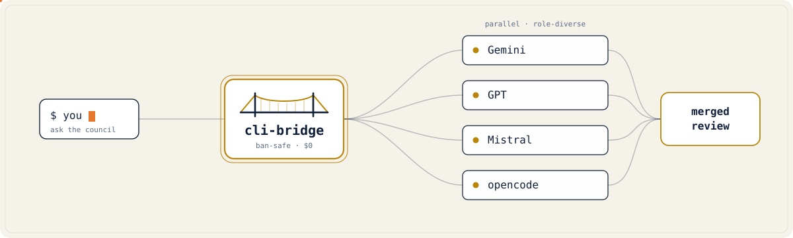
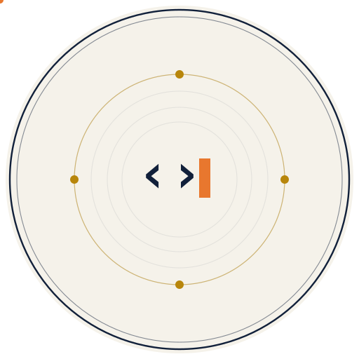

<div align="center">

<picture>
  <source media="(prefers-color-scheme: dark)" srcset="assets/banner-dark.svg">
  
</picture>

</div>

# cli-bridge 🌉


**Your AI assistant, but it can phone a friend.**

`cli-bridge` is a [Model Context Protocol](https://modelcontextprotocol.io) server that
**orchestrates the AI CLIs you've already installed and logged into** — Claude Code, Codex,
Gemini CLI, opencode, … — from whatever assistant you're talking to. No API keys, no token
extraction, a local-only log, a hard cost cap, and writes only as throwaway-worktree diffs.
That part is indisputable plumbing; here's what it unlocks:

Stuck on a gnarly bug? Have your assistant ask GPT *and* Gemini in parallel and compare. Need a
1M-token read of a huge file? Hand it to Gemini. Want a cheap second opinion? Fire it at a free
model. One question, every model, side by side — without leaving your terminal.

```
You → Claude:  "ask the council whether this auth logic is safe"
Claude → cli-bridge → [ Gemini ] [ GPT ] [ Mistral ] [ Qwen ] … in parallel
            ← three independent reviews + a synthesis of where they agree & disagree
```

> **Why it's different in one breath:** it never holds an API key and never extracts a token — it
> drives the official CLIs you've **already installed and logged into**. A free-lane council costs
> **$0.00** (the receipts are in `usage_report`); paid lanes only ever run inside a hard daily cap
> *you* set. And when you ask it to *do* work, it edits in a throwaway git worktree and hands back
> a **diff** — your live repo is never touched.

> **And the honest part:** "more models = better" is *fragile* — big models share training data,
> so their errors correlate. We measured our own central claim (`cli-bridge eval`, shipped, no LLM
> judge): a diverse council did **not** catch more bugs than one strong model — it cut the false
> alarms **~2×**. We publish the numbers either way ([BENCHMARKS.md](BENCHMARKS.md)), and the
> harness ships so you can run it on *your* CLIs.

---

## Why this one

There are other "call other models" MCPs. Here's what makes cli-bridge different:

- 🛡️ **Ban-safe by design.** It spawns each model's **official CLI** — exactly as you'd run it by
  hand. No OAuth-token extraction, no API-key reuse, nothing that gets accounts flagged. Each CLI
  handles its own auth and billing.
- 💸 **Sourced cost defaults, then *you* tune to your plan.** Out of the box `ask_all` builds a
  free council and never touches subscription quota (Claude, GPT) or paid credits unless you ask.
  Each lane ships a tier sourced from the vendor's published plans
  ([docs/COSTS.md](docs/COSTS.md), dated) — **never detected from your account, and labeled as
  such** — that you override per your own subscriptions
  (`CLI_BRIDGE_<LANE>_COST=free|limited|paid`); on a big plan, mark them all `free`, or set
  `CLI_BRIDGE_PROFILE=max`.
- 🔌 **Works from any host.** Driving Claude Code? It hides the Claude lane (no asking yourself)
  and exposes the rest. Driving Codex or opencode instead? Same deal, detected automatically from
  the MCP handshake.
- 🧩 **Add any CLI — or your own API — without forking.** Built-in lanes for Claude, GPT, Gemini,
  Mistral, Qwen, Copilot, Grok and opencode. Register **your own CLI from a JSON file**, or wrap
  **your own API** by spawning `curl`. Zero code.
- 🧠 **Council synthesis.** `ask_all` can have a free model summarize where the others *agree* and
  *disagree* — turn three opinions into one decision.
- 🔬 **Multi-model workflows.** `review_diff` and `security_review` fan **role-diverse** reviewers
  across the council, then merge + dedupe into one severity-ranked report. `debate` has models
  critique and revise each other over bounded rounds before a judge concludes.
- ✍️ **Read-only by default, writes on demand.** Opt into `agent: build` to have any capable lane
  actually **edit files** — or pick a specific `model` per call, including a **sibling of your own
  family** (ask Opus 4.6 from Claude Code 4.8).
- 🪶 **Subagent-style returns.** A delegate works in its own context and hands back a digest; huge
  outputs spill to a file and only a preview comes back, so your assistant's context stays lean.
- 🔁 **Automatic fallback.** `ask_cascade` tries lanes cheapest→strongest and moves on when
  one hits quota/auth/timeout — so a dead lane degrades gracefully instead of failing you.
- 🩺 **Self-aware.** Local telemetry tracks each lane's health and puts a lane in cooldown
  after repeated quota/auth/timeout failures, so `ask_all`/`ask_cascade` route around it.
- 🎯 **Learns your stack.** Rate a lane's answer 1–5 with `rate_lane` and `ask_best` prefers the
  models that actually win each task-type **on your machine** — a local quality signal stored in
  sqlite that survives `/compact` and restarts. Not a public leaderboard; *your* outcomes.
- 🧱 **Hardened.** Timeouts kill the whole process tree (no orphans burning quota), host
  cancellation kills the delegate, secrets are redacted, errors are classified
  (`quota` / `auth` / `timeout`) so your assistant knows what to do next. Works on
  macOS / Linux / Windows.
- 📐 **Measured, not asserted.** "More models find more bugs" is *falsifiable*, so cli-bridge
  ships the test: `cli-bridge eval` pits a council against one strong model + self-consistency
  at **equal call budget** on a corpus of seeded reasoning bugs, scored deterministically (no LLM
  judge). It reports mean ± sd with a "no measurable difference" guard and a per-bug win/loss
  table — and publishes the result even when the council loses. See
  [BENCHMARKS.md § Quality](BENCHMARKS.md#quality--does-a-council-actually-beat-one-strong-model).

### vs. other multi-model MCPs

| | cli-bridge | API-key gateways | token-reuse bridges |
|---|:---:|:---:|:---:|
| Ban-safe (spawns official CLI) | ✅ | ➖ (your keys) | ❌ (ToS risk) |
| No API keys to manage | ✅ | ❌ | ✅ |
| Uses your existing subscriptions ($0.00 free council) | ✅ | ❌ | ✅ |
| Per-plan cost tiers + hard daily cap + cooldown | ✅ | ➖ | ❌ |
| Automatic fallback (cascade) | ✅ | some | ❌ |
| Routing that **learns from your outcomes** | ✅ | ❌ | ❌ |
| Add any CLI / your own API, no fork | ✅ | ➖ | ❌ |
| Self-hides the calling host | ✅ | n/a | ➖ |
| Round-table memory that survives a restart | ✅ | ➖ (in-memory) | ➖ |
| Safe agentic write (worktree → diff) | ✅ | ➖ | ❌ |
| Ships a deterministic quality eval (council vs single) | ✅ | ❌ | ❌ |

---

## Quick start

### 1. Install

```bash
# zero-install run (recommended)
uvx cli-bridge-mcp

# or install it
uv tool install cli-bridge-mcp     # or: pipx install cli-bridge-mcp
```

You only get a lane for a CLI you've **already installed and logged into**. cli-bridge auto-detects
what's on your `PATH`. Run the `doctor` tool any time to see what's wired up (`doctor deep` even
live-checks each login).

| Lane | CLI | Cost (typical) |
|------|-----|------|
| `ask_claude`   | [Claude Code](https://docs.claude.com/claude-code) | subscription |
| `ask_gpt`      | [OpenAI Codex](https://github.com/openai/codex) | subscription |
| `ask_gemini`   | Gemini CLI (or `agy` / Antigravity) | free / subscription |
| `ask_mistral`  | Mistral Vibe | free tier |
| `ask_qwen` ⚗️  | Qwen Code | metered API key (free OAuth tier closed Apr 2026) |
| `ask_copilot` ⚗️ | GitHub Copilot CLI | subscription (usage-based credits since 2026-06) |
| `ask_grok` ⚗️  | xAI Grok CLI | subscription (SuperGrok / X Premium+) |
| `ask_opencode` | [opencode](https://opencode.ai) gateway (deepseek, qwen, glm, kimi…) | free by default; some models use credits |

⚗️ = experimental (flags not yet verified live — please report breakage).
Cost column = the vendor's *typical published plan* as of June 2026 ([docs/COSTS.md](docs/COSTS.md)
has limits, sunsets and sources) — cli-bridge never detects what a lane costs *you*; declare your
own plan with `CLI_BRIDGE_<LANE>_COST`.

### The $0 council (no subscriptions at all)

No paid plan, no card? You can still assemble a real multi-model council in ~5 minutes from
providers with a **genuinely free, hard-stop tier** (exhaustion = HTTP 429, a bill is
structurally impossible — verified June 2026, sources in [docs/COSTS.md](docs/COSTS.md)):

```bash
# 1. Get free API keys (no card): console.groq.com · cloud.cerebras.ai ·
#    a GitHub PAT (models scope) · openrouter.ai/keys
export GROQ_API_KEY=... CEREBRAS_API_KEY=... GITHUB_MODELS_TOKEN=... OPENROUTER_API_KEY=...
# 2. Point cli-bridge at the ready-made lanes
export CLI_BRIDGE_LANES_FILE=/path/to/examples/free-apis.json
```

That's **Groq** (llama-3.3-70b, 1k req/day) + **Cerebras** (gpt-oss-120b) + **GitHub Models**
(every GitHub account has free access) + **OpenRouter `:free`** breadth — four independent
voices for `ask_all`/`consensus`/`debate`, plus opencode's built-in free models if installed.
Caveats: Gemini CLI's free tier **sunsets 2026-06-18**; free tiers churn in weeks — check
[docs/COSTS.md](docs/COSTS.md) for what was true at verification time.

### 2. Register it with your host

**Claude Code** — one command:

```bash
claude mcp add cli-bridge -- uvx cli-bridge-mcp
```

<details>
<summary><b>Codex</b> (<code>~/.codex/config.toml</code>)</summary>

```toml
[mcp_servers.cli-bridge]
command = "uvx"
args = ["cli-bridge-mcp"]
```
</details>

<details>
<summary><b>opencode</b> / <b>Gemini CLI</b> / other MCP clients</summary>

Point your client's MCP config at the command `uvx cli-bridge-mcp` over stdio. Same everywhere.
</details>

### 3. Use it

Just talk to your assistant:

> *"Ask Gemini for a second opinion on this function."*
> *"Have the whole council review my diff and synthesize where they disagree."* (→ `review_diff`)
> *"Get GPT to think hard about this race condition."* (→ `effort: high`)
> *"Run a security review on my staged changes."* (→ `security_review`)
> *"Make the models debate whether we need this abstraction."* (→ `debate`)
> *"Ask gpt to implement this function."* (→ `agent: build`, edits files)
> *"Ask Opus 4.6 to double-check my reasoning."* (sibling model, from Claude Code)
> *"Pick the best lane for a deep review — and remember that one nailed it."* (→ `ask_best` + `rate_lane`; next time it routes there first)

Hosts that support MCP prompts also surface `review_diff`, `security_review`, `debate`,
`premortem`, `test_plan`, `apilookup`, and `cost_setup` as native slash commands.

---

## Tools

| Tool | What it does |
|------|--------------|
| `ask_<lane>` | Ask one model. Params: `task`, optional `model`, `effort`, `agent`, `cwd`, `timeout_s`, **`conversation`** (start/continue a round-table thread — see below). |
| `ask_all` | Fan-out the same question to every free, non-limited lane in parallel. `synthesize: true` adds an agreement/disagreement summary. `include_paid: true` to also query limited/paid lanes. |
| `ask_cascade` | Ask one model **with automatic fallback** — tries lanes cheapest→strongest, skipping cooled ones, moving on at quota/auth/timeout. Returns the first success + a trace of what was tried (cost tier, latency, why skipped). |
| `ask_best` | Pick **one lane by mode** (`fast`/`cheap`/`deep`/`code`/`review`/`security`) from cost, health, measured latency **and your own `rate_lane` scores**, then run it with fallback. For "just use the right model" — `ask_all` compares, `ask_cascade` is plain cheapest-first. |
| `rate_lane` | **Teach the router.** Score a lane's answer 1–5 for a task-type (`mode`) → `ask_best` then prefers the lanes that win that mode **on your machine**. Stored in sqlite (survives `/compact`/restart); a two-rating floor before any lane steers, so feedback is honest, not noisy. Every `ask_best` answer prints the exact call. |
| `route_plan` | Show the order `ask_cascade` would try, given your profile + current cooldowns (read-only, runs nothing). Pass `mode` to preview `ask_best` — including each lane's running rating. |
| `ask_all_async` / `job_status` / `job_result` / `job_cancel` / `jobs_list` | Run a fan-out as a **background job** that returns a job id in <1s, so a slow council run can't hit the host's tool-call deadline. Cancel kills the delegates' process groups. |
| `review_diff` | Multi-model code review of a git diff: lanes review in parallel with **different focuses** (correctness / security / tests / maintainability), each returning JSON findings; deterministic prechecks (secrets, dangerous shell) seed them; findings **merge by file/line/title** with agreement-based confidence (single/majority/consensus). `output_format: markdown` (default) or `json`. Params: `cwd`, `base` (default HEAD), `diff`, `include_paid`, `timeout_s`. |
| `security_review` | OWASP-aware **security-only** review of a git diff (injection / auth & access control / secrets & crypto / data exposure & SSRF) → severity-ranked findings + a `residual_risk` section. |
| `debate` | Several models answer a question, **see each other's answers and revise** over bounded rounds (default 1, max 3), then an **independent judge** (held out of the debate when 3+ lanes) writes the final consensus + remaining disagreement. Hardened from production use: `context_files` injects key files into every debater prompt (**grounding** — without it the council only paraphrases your brief), a **fact-check pass** (free lane, on by default) flags the verdict's unverifiable commands/tags/versions, claims carry provenance tags (`[brief]`/`[own-knowledge]`/`[verified]`), a thin brief gets a linter warning, and `steelman: true` makes one lane argue *against* a unanimous verdict before the judge re-concludes. `summary_only` drops the full positions (~60-80 % fewer tokens); `dry_run` returns a preflight data manifest (which files/chars go to which vendors) before anything is sent. Params: `task`, `rounds`, `adversarial`, `context_files`, `fact_check`, `summary_only`, `allow_self_judge`, `steelman`, `dry_run`, `include_paid`, `cwd`, `timeout_s`. |
| `consensus` | The "LLM council" done better: each lane answers blind, then **ranks the anonymized answers** (no self-favouring), votes are aggregated **deterministically** (Borda count), and the **peer-ranked #1 answer is returned verbatim** — because *selecting* the best answer beats *blending* them (arXiv 2603.20324: synthesis loses to baseline; selection wins, g=3.86). `synthesize: true` opts into a chairman blend (the weaker mode). Returns the final answer + a peer-vote ranking table. `dry_run` returns a preflight data manifest (which files/chars go to which vendors) without spawning. Supports `context_files` grounding and `summary_only`. Params: `task`, `context_files`, `synthesize`, `summary_only`, `dry_run`, `include_paid`, `cwd`, `timeout_s`. |
| `challenge` | Hand a claim to **one outside lane** with a critical-reassessment prompt → an independent skeptical review (with an integrity guardrail — it won't manufacture disagreement). Pressure-test your own conclusion before acting. Optional `lane`. |
| `premortem` | Each lane imagines the plan **already failed** and lists likely failure modes + mitigations; merged into a prioritized risk list. Run it before building. |
| `test_plan` | Derive a prioritized **test plan** (behaviors, edge cases, concrete cases) from a git diff or a description. |
| `commit_msg` | Generate a **Conventional Commit** message from your staged diff (falls back to the working tree). Read-only — emits text, never commits. Optional `lane`, `cwd`. |
| `pr_describe` | Generate a **PR title + description** (Summary / Changes / Testing) from the branch's diff + commit log vs a base (default origin/main → main). Read-only. Optional `base`, `lane`, `cwd`. |
| `ask_build_isolated` | **Safe write mode**: run a build-capable lane in a throwaway git worktree at HEAD and get the **diff** to review — your real repo is never modified. |
| `list_models` | List a lane's available models (`lane` param) where the CLI exposes them; otherwise shows the resolved default model + how to choose one. (`list_<lane>_models` also exists for lanes with a native list command.) |
| `conversations_list` / `conversation_show` | List recent **round-table threads** (recover an id after a context reset) / show one thread's full transcript, attributed by lane. |
| `doctor` | Health check: installed CLIs, detected host, cost/quota stance, cooldowns, defaults. `deep: true` live-probes each free lane's auth **and checks every lane's flags against its `--help`** — warns if a CLI renamed/removed a flag cli-bridge relies on (drift) before the lane fails silently. |
| `usage_report` | Local-only stats: runs, per-lane success/latency, and **estimated** tokens (chars/4) + credits (per-lane `CREDITS_PER_1K`). `since`, `format=text\|json`. |
| `usage_budget` | Today's runs per lane vs `CLI_BRIDGE_<LANE>_DAILY_LIMIT` + estimated spend; flags lanes over their limit. |
| `lane_stats` | Per-lane health: runs, failures, consecutive failures/timeouts, active cooldown. |
| `reset_lane_state` | Clear a lane's cooldown/failure counters (after re-login or quota reset). |
| `setup` | List installed lanes with their *sourced* typical-plan cost (free/limited/paid — never detected from your account), ask which you actually pay for, and **recommend a profile + daily cap** to confirm — then walk the user through it. |

There's also a **human CLI** — the same engine from your terminal or CI:
`cli-bridge init` (detect CLIs + print MCP wiring), `doctor`, `ask <lane> <task>`, `ask-all`,
`ask-best --mode`, `review-diff --base origin/main --json`, `bench --lane gemini --prompt … `
(latency p50/p95/p99), `usage`, `budget`, `jobs`, `setup --write`. See
`examples/github-action-pr-review.yml` for a PR-review GitHub Action (self-hosted runner).

**Read-only by default; opt-in writes.** A delegate normally analyses and answers — your host
applies any edits. Pass `agent: "build"` to let it **edit files directly** (e.g. *"ask gpt to
implement this function"*): claude → `--permission-mode acceptEdits`, gpt → `--sandbox
workspace-write`, mistral → `--agent accept-edits`, gemini → `--yolo` (or `agy`
`--dangerously-skip-permissions`), opencode → `--agent build`. Build-capable lanes are annotated
non-read-only, and a `build` run is never served from cache.

**Pick a model per call** with `model` (e.g. `model: "claude-opus-4-6"`). From inside a host you
can even consult a **sibling model of your own family** — `ask_<your-host>` appears as a separate
tool that requires an explicit `model`, so from Claude Code you can ask Opus 4.6 while running 4.8.
(Antigravity's `agy` has no per-call model flag — it uses whatever its own settings select.)

**Round-table conversations.** Pass `conversation: "new"` to any `ask_<lane>` to start a multi-turn
thread; reuse the returned id — **even on a different lane** — to continue. Each lane sees the
shared transcript with your own turns marked "You" and the others named, so a council can build on
each other instead of starting cold every time. The transcript is stored locally (sqlite), so a
thread **survives the host's context reset (`/compact`) and a server restart** — recover one with
`conversations_list`, read it with `conversation_show`. A sliding window
(`CLI_BRIDGE_CONVO_MAX_CHARS`, default 32000) keeps the newest turns and drops the oldest, so the
per-turn cost stays bounded however long the thread runs.

For opencode, an empty `model` asks `opencode models` for the current `opencode/*-free` list and
uses one (the $0 rate-limited tier), chosen by pattern + sorted — never a pinned name, so a retired
free model is replaced automatically. It's **cost-safe**: a bare `opencode/*` Zen model bills
per-token (API cost) and `opencode-go/*` spends prepaid credits, so the default never silently
selects a paid model — pass those explicitly when you want them. If the lookup fails it falls back
to a free seed; set `CLI_BRIDGE_OPENCODE_MODEL` to pin your own default.

`ask_all` keeps per-lane calls short (45s default, 60s max) so the MCP host gets a response before
its own tool-call deadline. For a slow/deep answer, call that lane directly with a longer
`timeout_s`.

---

## Configuration

Everything is environment variables — no code edits. Tune it to **your** subscriptions:

| Variable | Effect |
|----------|--------|
| `CLI_BRIDGE_<LANE>_COST` | `free`, `limited`, or `paid`. `free` joins `ask_all`; `limited` is quota-sensitive and skipped by broad fan-out; `paid` spends money/credits and is skipped by default. |
| `CLI_BRIDGE_<LANE>_ENABLED` | `false` to hide a lane even if its CLI is installed. |
| `CLI_BRIDGE_<LANE>_BIN` | Point a lane at a different binary (e.g. `CLI_BRIDGE_GEMINI_BIN=agy`). |
| `CLI_BRIDGE_<LANE>_MODEL` | Default model for a lane when the caller doesn't pass one. |
| `CLI_BRIDGE_PROFILE` | `saver`, `balanced`, or `max`. `max` includes limited/paid lanes in `ask_all` unless the caller overrides `include_paid`. |
| `CLI_BRIDGE_HOST` | Force the host identity (which lane to hide). Normally auto-detected. |
| `CLI_BRIDGE_LANES_FILE` | Path to a JSON file adding **your own** CLIs/APIs as lanes. |
| `CLI_BRIDGE_DISABLED_TOOLS` | Comma-separated tool names to hide from the listing (e.g. `debate,premortem,test_plan`) — trims the schema context every host pays per request. `doctor`/`setup` can't be hidden. |
| `CLI_BRIDGE_ENABLED_TOOLS` | Allowlist for a one-env **lean mode**: when set, only these tools (+ `doctor`/`setup`) are exposed (e.g. `ask_best,ask_all,review_diff`). |
| `CLI_BRIDGE_<LANE>_PRIORITY` | Lower runs earlier in `ask_cascade` (default 50). Pin your preferred order. |
| `CLI_BRIDGE_INLINE_MAX_CHARS` | Above this, an answer spills to a file instead of flooding context (default 12000). |
| `CLI_BRIDGE_TERSE` | `off` / `lite` (default) / `full` / `ultra`. Prepends a compact response-style preamble to delegate prompts (English, reason fully internally, answer terse, code/JSON untouched) to cut both your context and the delegate's output tokens. Never applied to structured workflow tools. |
| `CLI_BRIDGE_TERSE_MIN_CHARS` | Skip the terse preamble for tasks shorter than this many chars (default `0` = never skip). Tiny tasks can't repay the preamble's fixed overhead. |
| `CLI_BRIDGE_GUARD` | `off` / `warn` (default) / `strict`. Scans **delegate output** for prompt-injection / tool-poisoning; `warn` prepends a banner, `strict` withholds the body. Runs after secret redaction. |
| `CLI_BRIDGE_MOCK` | `1` = dry-run: lanes report installed and return a canned answer without spawning any CLI. Try the whole tool with **zero CLIs installed**. |
| `CLI_BRIDGE_RETRIES` | Retries on a TRANSIENT failure (default 1). Makes a flaky CLI work first-try; quota/auth/not-found/timeout are never retried. |
| `CLI_BRIDGE_TRACE_DIR` | If set, each delegation writes a redacted JSON trace (argv, timing, output) here — reproducible debug / audit. Off by default. |
| `CLI_BRIDGE_MAX_PARALLEL` | Cap on simultaneous delegate spawns in `ask_all` (default 6). Stops a wide council (many custom lanes) from OOM-ing a small machine or bursting quota. |
| `CLI_BRIDGE_DAILY_CREDIT_CAP` | Hard ceiling on *estimated* paid spend per UTC day. >0 refuses a paid lane once today's estimate hits it — makes "cost-safe" enforceable, not just reported. Free lanes never gated. |
| `CLI_BRIDGE_ALLOW_LANES` | Allowlist, e.g. `gemini,gpt`. Empty = all. Locked-down / team setups: only these lanes are exposed. |
| `CLI_BRIDGE_DISABLE_BUILD` | `1` forces every delegate to read-only (plan) even if a caller asks `agent: build`. For shared machines. |
| `CLI_BRIDGE_OVERFLOW_MAX_FILES` | Cap on overflow-dir file count (default 200); oldest beyond are pruned so `/tmp` can't grow unbounded. |
| `CLI_BRIDGE_CONFIG_FILE` | Path to a JSON config (default `~/.config/cli-bridge/config.json`). A friendlier alternative to env vars — **env always wins**. See below. |
| `CLI_BRIDGE_CACHE_TTL_S` | `0` = off (default). When `>0`, an identical call within this many seconds returns the cached answer instead of re-spawning the CLI (saves quota/credits on repeats; build runs are never cached). |
| `CLI_BRIDGE_<LANE>_CREDITS_PER_1K` | Credits per 1k tokens for a lane, used by `usage_report`/`usage_budget` to **estimate** spend (chars/4). |
| `CLI_BRIDGE_<LANE>_DAILY_LIMIT` | Max runs/day for a lane; `usage_budget` flags when exceeded. |
| `CLI_BRIDGE_<LANE>_MIN_INTERVAL_S` | Anti-burst spawn pacing: minimum seconds between spawns of this lane (default `0` = off). Set it (e.g. `2`) when a free tier rate-limits under back-to-back calls — same-lane bursts get evenly spaced, other lanes stay parallel. `lane_stats` hints when a lane shows the rate-limited pattern. |
| `CLI_BRIDGE_KEEP_WORKTREES` | Keep `ask_build_isolated` worktrees instead of discarding them (for inspection). |
| `CLI_BRIDGE_REVIEW_TIMEOUT_S` | Per-reviewer timeout for `review_diff` / `security_review` (default 180; these are deliberately heavier than `ask_all`). |
| `CLI_BRIDGE_OVERFLOW_TTL_H` | Hours before a spilled overflow file is pruned (default 24). |
| `CLI_BRIDGE_TELEMETRY` | `off` to disable the local run log / cooldown tracking (default on, machine-local only). |
| `CLI_BRIDGE_STATE_DB` | Path to the local sqlite state DB (default `~/.local/share/cli-bridge/state.sqlite`). |
| `CLI_BRIDGE_STORE_TRANSCRIPTS` | `true` to keep a longer task preview in telemetry (default: hash + 60-char preview only). |
| `CLI_BRIDGE_LOG` / `_LOG_FILE` | `debug`/`info` to log what ran where (default: silent). |

### Config file (instead of a wall of env vars)

Prefer a file? Drop `~/.config/cli-bridge/config.json` (or point `CLI_BRIDGE_CONFIG_FILE` at one).
It fills in any env var you haven't set — **the environment always wins**, and defaults still work
with no file at all:

```json
{
  "profile": "balanced",
  "guard": "warn",
  "daily_credit_cap": 5.0,
  "lanes": {
    "gemini":   { "cost": "free" },
    "opencode": { "cost": "free", "model": "opencode/deepseek-v4-flash-free" },
    "gpt":      { "cost": "limited", "daily_limit": 50 }
  }
}
```

### Add your own CLI (no fork)

`my-lanes.json`, then `CLI_BRIDGE_LANES_FILE=/path/to/my-lanes.json`:

```json
[
  {
    "key": "aider", "display": "Aider", "bin": "aider",
    "ask": ["--message", "{task}"], "model_flag": "--model",
    "client_ids": ["aider"], "note": "Aider one-shot via --message."
  }
]
```

You now have an `ask_aider` tool. (A custom lane with a built-in key, e.g. `grok`, *overrides*
the built-in — handy when your install's flags differ.)

**The wider ecosystem, ready to plug in:** `examples/community-lanes.json` ships best-effort
lanes for **Aider, Goose, Plandex, Amp, Crush, Amazon Q Developer CLI and Droid (Factory)** —
all marked experimental and `limited` (kept out of broad fan-out until *you* declare what they
cost you), and all covered by `doctor deep`'s flag-drift check, which validates each lane
against the CLI's own `--help` on *your* machine before anything breaks silently. Claude Code,
Codex, Gemini + Antigravity (`agy`), opencode, Qwen Code, Copilot and Grok are already
built-in. Anything else (Cline, OpenHands, Continue, Roo/Kilo Code, Kimi K2 CLI, …) is the
same 3-line JSON away — and any of these CLIs that speaks MCP can sit on the *other* side too,
running cli-bridge as its server.

### Bring your own API (no CLI needed)

Wrap any OpenAI-compatible endpoint by spawning `curl`. Your key stays in an env var, never in the
file. `{task_json}` is the prompt, JSON-escaped:

```json
[
  {
    "key": "myapi", "display": "My API", "bin": "curl", "default_model": "gpt-4o-mini",
    "paid": true,
    "ask": [
      "-sS",
      "--variable", "%MY_API_KEY",
      "--expand-header", "Authorization: Bearer {{MY_API_KEY}}",
      "https://api.openai.com/v1/chat/completions",
      "-d", "{\"model\":\"{model}\",\"messages\":[{\"role\":\"user\",\"content\":\"{task_json}\"}]}"
    ]
  }
]
```

The `--variable %MY_API_KEY` + `--expand-header` pair (curl ≥ 8.3) imports the key *inside*
curl — it never appears in the process list. `doctor` warns if a custom lane expands a `${ENV}`
secret into argv instead.

(See `examples/` for both, ready to copy.)

---

## How it works

```
host (Claude/Codex/…) ──MCP──> cli-bridge ──spawn──> official CLI ──> model
                                    │
              hides the host's own lane · only shows installed, enabled CLIs
              kills the whole process tree on timeout / cancellation
              redacts secrets · classifies errors · spills huge output to a file
```

No network calls of its own. No keys stored. It runs the same binaries you already trust, in your
working directory, and hands the answer back.

### Works in IDE MCP hosts too

cli-bridge is plain MCP over stdio, so any MCP-capable host works — not just terminal CLIs.
Point Cursor / VS Code (Cline, Continue) / Zed at the **same command** (`uvx cli-bridge-mcp`, or
`<python> -m cli_bridge`). The host's own lane is auto-hidden; everything else is identical.

### Known limitations (honest list)

- **Ban-safe depends on each provider's ToS.** cli-bridge only runs the official CLI you'd run
  by hand — but non-interactive/scripted use isn't *guaranteed* sanctioned and can change. Use
  your own accounts within their terms; treat "ban-safe" as "no token/key extraction", not a
  blanket guarantee.
- **Async jobs are in-process.** A server restart marks running jobs `interrupted` — no
  cross-restart resume in v1.
- **The injection guard is heuristic.** It catches high-signal patterns, not everything; in
  `warn` mode the text still reaches the host (treat delegate output as data).
- **Token/credit figures are estimates** (chars/4 + your `CREDITS_PER_1K`), never exact.
- **BYO-API (curl) lanes:** a `${ENV}` key is substituted into the argv, so it can appear in this
  machine's process list while the call runs (it's never logged — traces redact it). Prefer a
  provider's own CLI when possible; for curl, a header-file (`curl -H @file`) avoids argv exposure.
- **Experimental lanes** (`qwen`, `copilot`, `grok`): flags aren't verified live — report breakage.
- **Cost tiers are sourced defaults, not detection** — vendor-plan facts dated June 2026
  ([docs/COSTS.md](docs/COSTS.md)); plans/quotas churn, `doctor` warns when the snapshot is stale.
- **Sandboxed host:** if your host runs the server in a strict sandbox (read-only FS / no
  network), spawned CLIs inherit it and may fail to reach their providers. cli-bridge surfaces
  this as an `auth`/`failed` error rather than hanging.

---

## Development

```bash
uv venv && uv pip install -e . pytest pytest-asyncio
pytest -q          # unit + integration (cross-host) tests
```

## License

MIT

---

<div align="center">

<picture>
  <source media="(prefers-color-scheme: dark)" srcset="assets/mark-dark.svg">
  
</picture>

<sub>one side · bridged to a council</sub>

</div>
