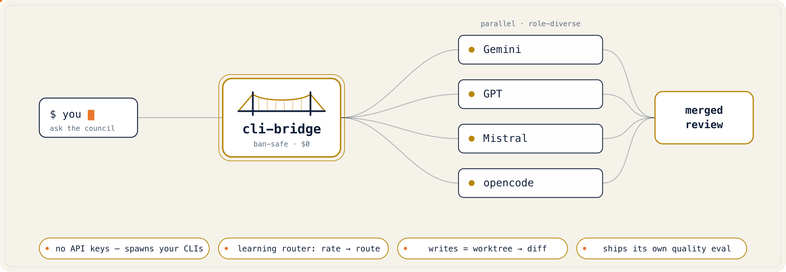
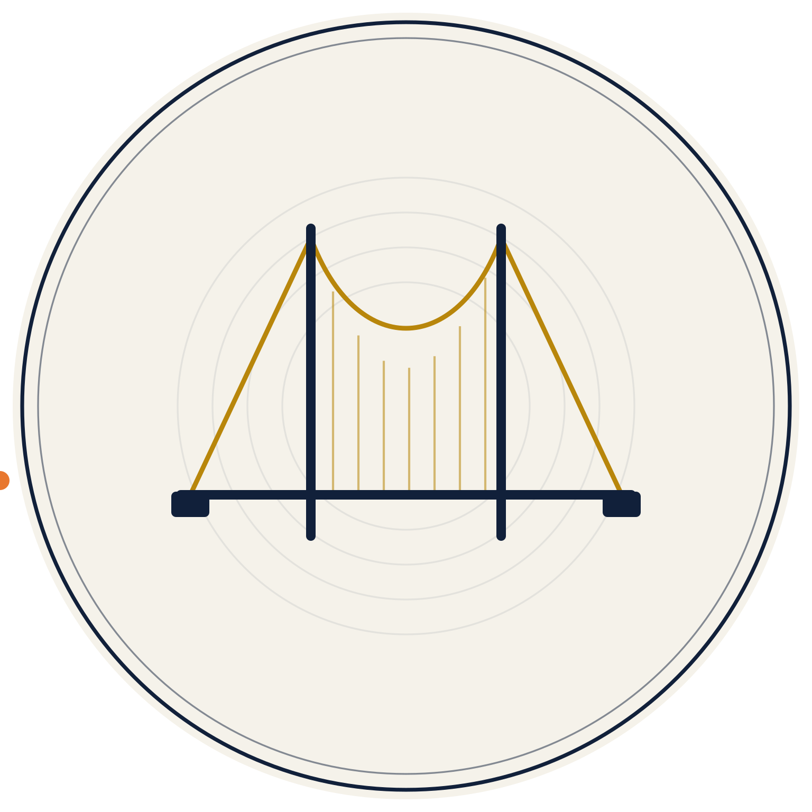

<div align="center">



**English** · [Français](docs/i18n/README.fr.md) · [简体中文](docs/i18n/README.zh-CN.md) · [Español](docs/i18n/README.es.md) · [Português (BR)](docs/i18n/README.pt-BR.md) · [日本語](docs/i18n/README.ja.md) · [Deutsch](docs/i18n/README.de.md)

</div>

# cli-bridge

<!-- Re-add at go-public (both break while the repo is private / unpublished):

 -->


**Your assistant, with the powers of every CLI you already have.**

> **No API keys · no token extraction · no Node · no daemon · stdlib + `mcp` only.**

The assistant you're talking to can't read a 2M-token repo in one pass, can't see a screenshot,
can't hand you a generated image, and can't check its own work without bias. The other AI CLIs
you've **already installed and logged into** — Claude Code, Codex, Gemini, opencode, plus local
models via Ollama — each do something yours can't. `cli-bridge` is a [Model Context Protocol](https://modelcontextprotocol.io) server
that lets your assistant **borrow them**: it spawns the official CLI as a subprocess (exactly as
you'd run it by hand — no keys, no token extraction) and hands the result back.

---

## The 10-second demo

You're in Claude. Claude can't hand you an image. Codex can — it writes the code that renders one
and runs it. So ask it:

```
ask_build(lane="gpt", task="generate a 1200×630 social card to assets/card.png — write a script that renders it, then run it", zone="assets")
→ Codex writes assets/card.png · you get the path back, never a binary blob (artifact-return)
```

Your assistant just gained an ability it doesn't have. That's the whole idea — now scale it to
giant-context reads, vision, parallel grunt-work, and independent cross-vendor verification.

_(The lane renders the image **via code** — charts, diagrams, SVGs, procedural art — and hands back
the file; it's not a text-to-photo model unless you point one at it. That's why the result comes back
as a path, not a blob.)_

---

## How to think about it (the mental model)

cli-bridge isn't one feature, it's **four levers**. Get these and every tool below slots into place:

1. **Borrow** — reach a capability your assistant lacks (vision, a 1M-token context window, a file a
   coding agent generates, a model that's simply better at *this*).
2. **Spread** — when one subscription hits its limit, keep going on another lane you already pay for.
3. **Offload** — fan laborious, parallel grunt-work across cheap/free lanes while you build elsewhere.
4. **Verify** — have a *different vendor family* check the work, because a model can't catch its own
   blind spots. This is the one thing a single-vendor tool structurally cannot do.

---

## What this unlocks

Each block: one sentence of *when you reach for it*, the exact call, and *what you get back*.

### Borrow abilities your assistant doesn't have
Every CLI has a different superpower, and each runs non-interactively — so cli-bridge can spawn it.
Borrow the one your host lacks (it must be installed + logged in):

| Superpower | Which CLI has it | Borrow it when |
|------------|------------------|----------------|
| **Images** | Codex (`gpt-image-2`, **no API key** — via your ChatGPT plan) | your host can't draw |
| **Huge context** | Gemini (1M-token window) | a file/repo won't fit your host's context |
| **Fresh knowledge** | Gemini (Google-Search grounding) · Grok (live web/X) ⚗️ | beat a stale cutoff: *"what's the current API of `<lib>`?"* |
| **Vision** | Gemini (`images=[…]`) ⚗️ | analyse a screenshot or diagram |
| **A free second opinion** | Gemini (free daily tier) · opencode · Ollama (local, $0) | a $0 cross-check |
| **Generated files** | any build lane → artifact-return | get a chart / PDF / diagram back **by path** |
| **Video** ⚗️ | Gemini (Veo) · Grok (Imagine) — *if your installed CLI exposes it* | you need a generated clip |

```
ask_build(lane="gpt", task="generate a 1200×630 social card to assets/card.png", zone="assets")   # Codex image → file by path, no API key
ask_gemini(task="find the bug across ./src — read the files you need", cwd="path/to/repo")         # 1M-token context
ask_gemini(task="what's the current recommended API for <lib>? check the latest docs")            # fresh knowledge (Search grounding)
ask_gemini(task="what's wrong in this UI?", images=["screenshot.png"])                             # vision (experimental)
```

⚗️ = experimental / depends on the installed CLI's current build (e.g. Grok Build is beta) — verify with `doctor deep`.

### Never stop working when you hit a limit
When your main subscription caps out mid-task. `ask_cascade` falls through to another lane you already
pay for, skipping any lane that's cooled down after a quota/auth/timeout error.

```
ask_cascade(task="finish wiring this endpoint")   # cheapest→strongest; a cooled-down lane is skipped
ask_best(task="…", mode="deep")                   # let the router pick the most suitable available lane
```

### Offload the grunt work — in parallel, and cheap
When the work is laborious but not hard (refactors, migrations, test coverage). Fan it out, journaled
so a server restart resumes instead of restarting; delegate a build and keep working.

```
batch_run(tasks=[...], dry_run=true)                       # cost envelope first — nothing is spawned
batch_run(tasks=[...], max_calls=20, max_credits=2.0)      # then run under a hard budget (resumable)
ask_build(lane="opencode", task="add the landing page", zone="frontend", mode="direct", async=true)   # delegate, keep building
job_tail(job_id="…")  ·  build_steer(job_id="…", instruction="use Tailwind, not inline CSS")
```

### Break self-confirmation — the 2026 problem one vendor can't solve
When you need to *trust* a result. A model reviewing its own work (or a sibling's) just confirms its
own blind spots. cli-bridge puts a **different model family** in the reviewer's seat.

```
workflow(preset="jury", task="is this migration safe?", author_lane="gpt")            # cross-family vote, fail-closed
workflow(preset="verify_repair", task="add retry with backoff",
         builder_lane="gpt", verifier_lane="gemini")                                   # A builds, B reviews, loop to green
security_review(base="origin/main")   ·   review_diff(base="origin/main")              # OWASP, severity-ranked
```

### Get a real second opinion
When you've reached a conclusion and want it pressure-tested, or several models side by side.

```
challenge(task="I'm dropping the cache layer — here's why: …")                         # one skeptic attacks it
consensus(task="which migration strategy is safest here?")                             # N answer, peer-rank the best
workflow(preset="fanout_compare", task="fix this failing test", lanes=["gpt","gemini","opencode"])
```

---

## The full toolbox

Every tool, grouped by what you're trying to do. Run `CLI_BRIDGE_LEAN=1` for a curated ~12-tool
surface; hide/show any with `CLI_BRIDGE_DISABLED_TOOLS` / `CLI_BRIDGE_ENABLED_TOOLS`.

### Consult (read-only)
| Tool | What it does | Reach for it when |
|------|--------------|-------------------|
| `ask_<lane>` | Ask one specific CLI — `ask_gemini`, `ask_gpt` (Codex), `ask_opencode`, `ask_ollama`, and `ask_qwen`/`ask_grok`/`ask_copilot` when installed. Supports `role="reviewer\|security\|planner\|devil"`, `conversation` (round-table memory), and `images=[…]` on Gemini. | You want a particular model's strength, persona, or modality. |
| `ask_all` | Same question to every *free* lane in parallel; returns each answer **plus a disagreement score**. `synthesize: true` adds an agree/disagree summary. | You want breadth fast and a signal of where models diverge (= uncertainty). |
| `ask_cascade` | Tries lanes in a deterministic order, stops at the first good answer, skips cooled-down lanes; optional confidence-escalation. | You want resilience: a capped/failing lane is skipped automatically. |
| `ask_best` | A router picks the most suitable lane by `mode` (`fast/cheap/deep/code/review/security`) + your `rate_lane` scores. | You don't want to choose a lane by hand. |
| `ask_all_async` + `job_status`/`job_result`/`job_cancel`/`jobs_list` | Fire `ask_all` as a background job (id in <1s). | The fan-out is slow and you want to keep working. |
| `consensus` | N lanes answer, then peers rank to **select** the best (selection beats synthesis). | A single defensible answer matters more than a blend. |
| `challenge` | One lane plays skeptic against a conclusion you supply. | You want your own reasoning attacked before you commit. |
| `conversations_list` / `conversation_show` | List / read persistent round-table threads (survive `/compact` and restarts). | You want to recover or read a multi-model thread. |

### Build (opt-in write)
| Tool | What it does | Reach for it when |
|------|--------------|-------------------|
| `ask_build` | Delegates a real build. `mode=isolated` (default) edits a throwaway worktree → **diff**; `mode=direct` writes into a declared `zone` (per-zone lock + post-turn zone-violation check). `async=true` runs it as a steerable job. Non-text outputs come back **by path** (artifact-return). | You want work *done*, not just suggested — review-gated or hands-off. |
| `job_tail` | Streams a running build's progress log (byte-offset). | You want to watch a delegate work. |
| `build_steer` | Queues a steering instruction for the next turn, or `interrupt=true` cuts the current turn (files kept). | You need to course-correct mid-build without restarting. |

Async builds run against an executable **Definition-of-Done** gate (`dod_cmd`) — the delegate's claim
of success is *tested*, not trusted.

### Review & verify
| Tool | What it does | Reach for it when |
|------|--------------|-------------------|
| `review_diff` | Structured review of a diff → findings (severity, file, rationale), deterministically merged across lanes with single/majority/consensus confidence. | Before a change lands. |
| `security_review` | OWASP-oriented, severity-ranked security pass + a `residual_risk` section. | The change touches auth, input handling, secrets. |
| `debate` | Models critique each other over bounded rounds, ending with a `VOTE` footer + convergence early-stop; an independent judge concludes. | A genuinely contested decision. |
| `premortem` / `test_plan` | Failure-mode analysis of a plan / a prioritized test plan from a diff or description. | Before writing code. |
| `commit_msg` / `pr_describe` | A Conventional-Commit message from your staged diff / a PR title+body from the branch. Read-only — emits text. | You're about to commit or open a PR. |
| `workflow(preset=…)` | Named pipelines: `jury` (cross-family k-of-N vote, fail-closed), `verify_repair` (cross-model build→review→repair loop), `refine_plan`, `fanout_compare`, `council_review`, `map_review`, `research_verify`. | You want a vetted multi-step pattern in one call. |

### Orchestrate
| Tool | What it does | Reach for it when |
|------|--------------|-------------------|
| `batch_run` | Durable, **journaled** fan-out over many tasks. `dry_run=true` returns a cost envelope (nothing spawned); `max_calls`/`max_credits` cap spend; `resume_id` replays finished tasks and runs only the rest across a restart. | Bulk work you want bounded and crash-safe. |

### Operate
| Tool | What it does | Reach for it when |
|------|--------------|-------------------|
| `usage_report` / `usage_budget` | Estimated token/credit accounting (chars/4 — honestly labeled an estimate) + budgeting vs a daily cap. | You want to see the bill / set a cap. |
| `rate_lane` / `route_plan` | Score a lane 1–5 for a mode so `ask_best` learns your stack / preview the order a cascade would try. | You want the router to improve over time. |
| `lane_stats` / `reset_lane_state` | Per-lane health, cooldowns, and the "earn their seat" jury signal / clear a lane's counters. | A lane is misbehaving, or you want the seat report. |
| `set_lane_cost` | Record what a lane costs *you* ("Codex is free on my plan") — persisted, no `setup` needed. | You tell it a pricing fact in passing. |
| `doctor` / `setup` | Detect installed CLIs + resolved paths; `doctor deep` validates each lane against its own `--help` on your machine. | First run, or when a lane breaks. |
| `list_models` / `list_<lane>_models` | List a lane's models where the CLI exposes them. | You want to pick a specific model. |

There's also a **human CLI** (`cli-bridge doctor|ask|ask-all|ask-best|review-diff|eval|…`) — the same
engine from your terminal or CI (`--json` everywhere).

---

## What you actually get when you combine them

One assistant whose ceiling on **every axis is the ecosystem's best** — not the tool you opened this
morning: code with the strongest model, read 1–2M tokens when yours is too short, answer with fresh
knowledge past a stale cutoff, generate images/video, see screenshots, and fall back to a free/local
lane when you're capped — spread across the subscriptions you already pay for.

The emergent property **no single CLI has: true cross-vendor control** — a *different vendor* in the
reviewer's seat. Same-family subagents (Claude Code's, Grok's) can only self-confirm.

The honest seam: this unites **capabilities, not mind** — stateless spawns (no shared memory), spawn
latency/cost, uneven quality, and the host always drives. It's **orchestration, not fusion**: you
conduct specialists, you don't get one brain with every power.

→ Per-CLI strengths & limits (dated, churns fast): **[docs/COMPARISON.md](docs/COMPARISON.md)**.

## Why cli-bridge (and not another "call other models" MCP)

- 🛡️ **Ban-safe by design.** It spawns each model's **official CLI**, exactly as you'd run it by hand —
  no OAuth-token extraction, no API-key reuse. Each CLI handles its own auth and billing.
- 💸 **Cost-safe defaults you tune to your plan.** Out of the box `ask_all` / `ask_cascade` build a
  *free* council and never touch paid quota unless you ask. Each lane ships a tier sourced from the
  vendor's published plans (dated in [docs/COSTS.md](docs/COSTS.md), **never detected from your
  account**); override per lane with `CLI_BRIDGE_<LANE>_COST=free|limited|paid`.
- 🔌 **Works from any host.** Claude Code, Codex, opencode, Cursor, VS Code (Cline/Continue), Zed —
  anything that speaks MCP over stdio. The host's own lane is kept out of fan-out; hide it with
  `CLI_BRIDGE_HIDE_HOST=1`. Even a **local model can be the host** — see
  [`examples/local-first-host.md`](examples/local-first-host.md).
- 🧭 **The cross-vendor edge is the moat.** Independent verification means a *different vendor* in the
  reviewer's seat — the scarce thing as AI writes a larger share of code, and exactly what a
  single-vendor tool can't offer.

---

## How it works

```
host (Claude/Codex/…) ──MCP──> cli-bridge ──spawn──> official CLI ──> model
                                    │
       keeps the host's own lane out of fan-out · only shows installed, enabled CLIs
       kills the whole process tree on timeout/cancellation · redacts secrets
       classifies errors (auth/limit/failed) · spills huge output to a file
```

No network calls of its own. No keys stored. It runs the same binaries you already trust, in your
working directory, and hands the answer back.

<div align="center">


_Real run (2.5× speed): the Verify lever — `security-review` fans OWASP roles across free models in
parallel; two flag a committed auth bypass **blocker** independently, and `usage` shows the receipts._

</div>

---

## Writing code safely: two modes

Writes are contained, two ways — **you pick** review-gated or hands-off:

- **`isolated` (default).** Edits in a throwaway git worktree and hands back a **diff**. Your working
  tree is never touched.
- **`direct`.** Writes real files, **but only inside a `zone` you declare**, behind a per-zone lock
  with a post-turn zone-violation check. You in `backend/`, a delegate in `frontend/`, concurrently —
  neither can scribble across your whole repo; undo is zone-scoped, never a global reset.

Delegate re-entry is depth-capped (`CLI_BRIDGE_MAX_DEPTH`, default 1) so a misconfigured delegate
can't fork-bomb the council.

---

## Quick start (≈5 min)

```bash
# Run it (no install):
uvx cli-bridge-mcp
# or:  python -m cli_bridge

# Point your MCP host at that same command, then:
cli-bridge doctor        # see which CLIs are detected + their resolved paths
```

### Lanes

**Built-in:** Claude Code, Codex, Gemini (+ Antigravity `agy`), opencode, **Ollama (local models, $0,
offline)**, Qwen Code, Copilot, Grok.

**Local runtimes** beyond Ollama — **LM Studio · MLX · llama.cpp** — ship as zero-code recipes:
point `CLI_BRIDGE_LANES_FILE` at [`examples/lmstudio.lane.json`](examples/lmstudio.lane.json),
[`mlx.lane.json`](examples/mlx.lane.json), or [`llamacpp.lane.json`](examples/llamacpp.lane.json).
(Several local runtimes of the *same* open weights give correlated answers — real council diversity
comes from distinct vendors, not a second local runtime.)

**Community lanes** (`examples/community-lanes.json`, experimental + `limited` until you declare their
cost): Aider, Goose, Plandex, Amp, Crush, Amazon Q Developer CLI, Droid.

**Anything else is ~3 lines of JSON.** Add a custom lane, or wrap any OpenAI-compatible endpoint by
spawning `curl` (key kept inside curl, never in argv). See [`examples/`](examples/) for recipes.

---

## The honest part

"More models = better" is *fragile* — big models share training data, so their errors correlate. We
measured our own central claim (`cli-bridge eval`, no LLM judge): a diverse council did **not** catch
more bugs than one strong model — it cut the false alarms **~2×**. Same catch rate, far less noise —
which is exactly what keeps a reviewer trustworthy instead of muted. **Precision is the product, not
recall.** The harness ships, so you can confirm it on *your* CLIs — numbers either way in
[docs/BENCHMARKS.md](docs/BENCHMARKS.md).

---

## Known limitations

- **Ban-safe = no token/key extraction**, not a blanket guarantee — non-interactive use of a
  provider's CLI isn't formally sanctioned everywhere and can change. Use your own accounts within
  their terms.
- **Async jobs are in-process** — a server restart marks running jobs `interrupted`. `batch_run` /
  `workflow` are the exception: they journal each task and resume via `resume_id`.
- **The injection guard is heuristic** — it catches high-signal patterns, not everything; treat
  delegate output as data, not instructions.
- **Token/credit figures are estimates** (chars/4 + your `CREDITS_PER_1K`), never exact.
- **Cost tiers are sourced defaults, not detection** — vendor-plan facts are dated; `doctor` warns
  when the snapshot is stale.
- **Experimental** (`qwen`, `copilot`, `grok`, community lanes, Gemini `images=`): flags aren't
  verified live — `doctor deep` checks them against each CLI's `--help` on your machine.

---

## Roadmap

See [`CHANGELOG.md`](CHANGELOG.md) for shipped history. Currently **exploring (not shipped)**: an
**independent-oracle** verify mode (a cross-family lane writes tests from the *spec*, blind to the
implementation, so the test catches the bug instead of mirroring it) and tighter **limit-aware
failover**. Big inter-agent "bus" ideas (recursive spawn, shared state, wire protocol) are positioned
honestly as a *direction*, never sold as a shipped protocol — see [docs/ARCHITECTURE.md](docs/ARCHITECTURE.md).

---

## References

The design choices above aren't vibes — each maps to a finding in the literature. Every entry was
checked against its source (authors + venue), because a tool that sells "honest cross-vendor
verification" should get its own citations right.

| Paper | ID | What it backs here |
|-------|----|--------------------|
| Du et al. — *Improving Factuality and Reasoning via Multiagent Debate* | [2305.14325](https://arxiv.org/abs/2305.14325) | `debate`: models critiquing each other beat one model alone |
| ReConcile — *Round-Table Conference Improves Reasoning* | [2309.13007](https://arxiv.org/abs/2309.13007) | `debate` convergence + confidence-weighted consensus |
| Mixture-of-Agents | [2406.04692](https://arxiv.org/abs/2406.04692) | layered aggregation across diverse models (and its limits) |
| Chain-of-Agents | [2406.02818](https://arxiv.org/abs/2406.02818) | role-specialized multi-agent pipelines |
| CriticGPT — *LLM Critics Help Catch LLM Bugs* | [2407.00215](https://arxiv.org/abs/2407.00215) | `review_diff` / `security_review`: an LLM critic catches bugs humans miss |
| Perez et al. — *Discovering Language Model Behaviors* (sycophancy) | [2212.09251](https://arxiv.org/abs/2212.09251) | why a same-family judge is weak → cross-vendor `jury` + peer anonymization |
| Wynn, Satija & Hadfield — *Talk Isn't Always Cheap* | [2509.05396](https://arxiv.org/abs/2509.05396) | debate failure modes → fail-closed verdicts, bounded rounds |
| CONSENSAGENT — *Consensus via Sycophancy Mitigation* (Findings of ACL 2025) | [ACL 2025](https://aclanthology.org/2025.findings-acl.1141/) | sycophancy in consensus → "earn their seat" / anonymized peers |
| Maryanskyy — *When Agents Disagree: The Selection Bottleneck* | [2603.20324](https://arxiv.org/abs/2603.20324) | `consensus`: **selection > synthesis** (the deterministic peer-vote default) |

> **A citation hygiene note.** *Talk Isn't Always Cheap* (2509.05396) is **Wynn, Satija & Hadfield** —
> a popular council framework miscites it as "Xiong et al." We double-check attributions before
> repeating them, and flag it because honesty is the whole pitch.

## Development

```bash
uv venv && uv pip install -e . pytest pytest-asyncio
pytest -q          # unit + integration (cross-host) tests; no real CLI or network needed
```

## License

MIT

---

<div align="center">



<sub>one side · bridged to a council</sub>

</div>
