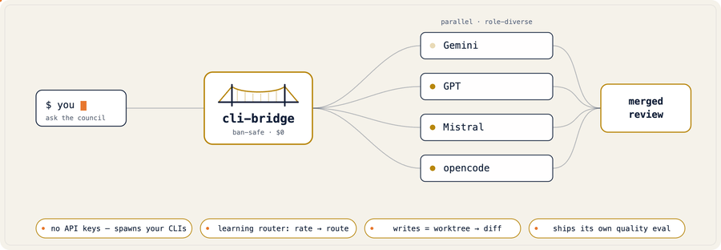
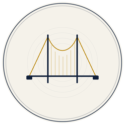

<div align="center">



[English](../../README.md) · [Français](README.fr.md) · [简体中文](README.zh-CN.md) · [Español](README.es.md) · [Português (BR)](README.pt-BR.md) · **日本語** · [Deutsch](README.de.md)

</div>

_英語版 README が正本です。この翻訳は遅れている場合があります。コミュニティによるレビューを歓迎します。_

# cli-bridge

<!-- 公開時に再有効化（リポジトリが非公開／未公開の間はどちらも壊れます）：

 -->


**あなたのアシスタントに、すでに持っているあらゆる CLI の力を。**

> **API キー不要 · トークン抽出なし · Node 不要 · デーモン不要 · stdlib + `mcp` のみ。**

あなたが話しているアシスタントは、200 万トークンのリポジトリを一度に読むことも、スクリーンショットを見ることも、
生成した画像を渡すことも、自分の作業をバイアスなく検証することもできません。**すでにインストールしてログイン済み**の
他の AI CLI ——Claude Code、Codex、Gemini、opencode、さらに Ollama 経由のローカルモデル——は、それぞれあなたの
ものにはできないことができます。`cli-bridge` は [Model Context Protocol](https://modelcontextprotocol.io)
サーバーで、アシスタントがそれらを**借りる**ことを可能にします。公式 CLI をサブプロセスとして起動し（手で実行する
のとまったく同じ——鍵なし、トークン抽出なし）、結果を返します。

---

## 10 秒デモ

あなたは Claude の中にいます。Claude は画像を渡せません。Codex はできます——画像を描くコードを書いて実行する
からです。だから頼みましょう：

```
ask_build(lane="gpt", task="generate a 1200×630 social card to assets/card.png — write a script that renders it, then run it", zone="assets")
→ Codex writes assets/card.png · you get the path back, never a binary blob (artifact-return)
```

あなたのアシスタントは、持っていなかった能力を今得ました。それが全体のアイデアです——これを巨大コンテキストの
読み込み、ビジョン、並列の力仕事、独立したベンダー横断の検証へと拡張するのです。

_（レーンは画像を**コードで**レンダリングします——チャート、図、SVG、プロシージャルアート——そしてファイルを
返します。対象を指定しない限りテキスト→写真モデルではありません。だから結果は blob ではなくパスで返ります。）_

### …そして本物の作業を、安全に委譲する

`cli-bridge build <lane> "<タスク>"` は、**使い捨ての git ワークツリー**で動く別のモデルに作業を渡し、
**diff** を返します——あなたが自分で適用するまで、リポジトリは決して触られません。

<p align="center">

</p>

---

## 考え方（メンタルモデル）

cli-bridge は単一機能ではなく、**4 つのレバー**です。これを掴めば、以下のすべてのツールが収まる場所を見つけます：

1. **借りる（Borrow）** — アシスタントに欠けた能力に手を伸ばす（ビジョン、100 万トークンのコンテキスト窓、
   コーディングエージェントが生成するファイル、単に*これ*が得意なモデル）。
2. **分散する（Spread）** — あるサブスクが上限に達したら、すでに支払っている別のレーンで続行する。
3. **オフロードする（Offload）** — 退屈で並列化可能な力仕事を、安価／無料のレーンに振り分け、自分は別の所で作る。
4. **検証する（Verify）** — *別のベンダーファミリー*に作業をチェックさせる。モデルは自分の盲点を捉えられない
   から。これは単一ベンダーのツールが構造的にできない唯一のことです。

---

## これで何が可能になるか

各ブロック：*いつ使うか*の一文、正確な呼び出し、そして*何が返るか*。

### アシスタントが持たない能力を借りる
各 CLI には異なるスーパーパワーがあり、それぞれ非対話モードで動く——だから cli-bridge は起動できます。ホストに
欠けたものを借りましょう（インストール済み＋ログイン済みである必要があります）：

| スーパーパワー | どの CLI が持つか | こんなとき借りる |
|------------|------------------|----------------|
| **画像** | Codex（`gpt-image-2`、**API キー不要**——ChatGPT プラン経由） | ホストが描けないとき |
| **巨大コンテキスト** | Gemini（100 万トークンの窓） | ファイル／リポジトリがホストのコンテキストに収まらないとき |
| **新鮮な知識** | Gemini（Google 検索グラウンディング）· Grok（ライブ web/X）⚗️ | 学習打ち切りを越える：*「`<lib>` の現在の API は？」* |
| **ビジョン** | Gemini（`images=[…]`）⚗️ | スクリーンショットや図を解析する |
| **無料のセカンドオピニオン** | Gemini（無料の日次枠）· opencode · Ollama（ローカル、0 $） | 0 $ のクロスチェック |
| **生成ファイル** | 任意のビルドレーン → artifact-return | チャート／PDF／図を**パスで**受け取る |
| **動画** ⚗️ | Gemini（Veo）· Grok（Imagine）——*インストール済み CLI が公開していれば* | 生成クリップが必要なとき |

```
ask_build(lane="gpt", task="generate a 1200×630 social card to assets/card.png", zone="assets")   # Codex image → file by path, no API key
ask_gemini(task="find the bug across ./src — read the files you need", cwd="path/to/repo")         # 1M-token context
ask_gemini(task="what's the current recommended API for <lib>? check the latest docs")            # fresh knowledge (Search grounding)
ask_gemini(task="what's wrong in this UI?", images=["screenshot.png"])                             # vision (experimental)
```

⚗️ = 実験的／インストール済み CLI の現在のビルドに依存（例：Grok Build はベータ）——`doctor deep` で確認。

### 上限に達しても作業を止めない
メインのサブスクがタスク途中で枯渇したとき。`ask_cascade` は、すでに支払っている別のレーンへフォールバックし、
クォータ／認証／タイムアウトのエラー後にクールダウン中のレーンをスキップします。

```
ask_cascade(task="finish wiring this endpoint")   # cheapest→strongest; a cooled-down lane is skipped
ask_best(task="…", mode="deep")                   # let the router pick the most suitable available lane
```

### 力仕事をオフロード——並列で、安く
作業が退屈だが難しくないとき（リファクタ、マイグレーション、テストカバレッジ）。ジャーナル付きで分散させ、
サーバー再起動時に最初からやり直すのではなく再開できるように。ビルドを委譲して作業を続けましょう。

```
batch_run(tasks=[...], dry_run=true)                       # cost envelope first — nothing is spawned
batch_run(tasks=[...], max_calls=20, max_credits=2.0)      # then run under a hard budget (resumable)
ask_build(lane="opencode", task="add the landing page", zone="frontend", mode="direct", async=true)   # delegate, keep building
job_tail(job_id="…")  ·  build_steer(job_id="…", instruction="use Tailwind, not inline CSS")
```

### 自己確認を打破する——単一ベンダーには解けない 2026 年の問題
結果を*信頼*する必要があるとき。自分の作業（または兄弟の作業）をレビューするモデルは、自分の盲点を確認する
だけです。cli-bridge は**別のモデルファミリー**をレビュアー席に座らせます。

```
workflow(preset="jury", task="is this migration safe?", author_lane="gpt")            # cross-family vote, fail-closed
workflow(preset="verify_repair", task="add retry with backoff",
         builder_lane="gpt", verifier_lane="gemini")                                   # A builds, B reviews, loop to green
security_review(base="origin/main")   ·   review_diff(base="origin/main")              # OWASP, severity-ranked
```

### 本物のセカンドオピニオンを得る
結論に達して、それを圧力テストしたいとき、または複数のモデルを並べて見たいとき。

```
challenge(task="I'm dropping the cache layer — here's why: …")                         # one skeptic attacks it
consensus(task="which migration strategy is safest here?")                             # N answer, peer-rank the best
workflow(preset="fanout_compare", task="fix this failing test", lanes=["gpt","gemini","opencode"])
```

---

## ツールボックス全体

すべてのツールを、目的別にグループ化。`CLI_BRIDGE_LEAN=1` で厳選された約 12 ツールの面に；
`CLI_BRIDGE_DISABLED_TOOLS` / `CLI_BRIDGE_ENABLED_TOOLS` で任意のものを隠す／表示する。

### コンサルト（読み取り専用）
| ツール | 何をするか | こんなとき使う |
|------|--------------|-------------------|
| `ask_<lane>` | 特定の CLI に尋ねる——`ask_claude`、`ask_gpt`（Codex）、`ask_gemini`、`ask_mistral`、`ask_opencode`、`ask_ollama`、インストール済みなら `ask_qwen`/`ask_grok`/`ask_copilot`。`role="reviewer\|security\|planner\|devil"`、`conversation`（ラウンドテーブルの記憶）、Gemini の `images=[…]` をサポート。 | 特定モデルの強み・ペルソナ・モダリティが欲しいとき。 |
| `ask_all` | 同じ質問を各*無料*レーンに並列で；各回答**＋不一致スコア**を返す。`synthesize: true` で一致／不一致の要約を追加。 | 速く幅が欲しく、モデルが分かれる箇所（＝不確実性）の signal が欲しいとき。 |
| `ask_cascade` | 決定論的順序でレーンを試し、最初の良い回答で停止、クールダウン中のレーンをスキップ；任意の確信度エスカレーション。 | 回復力が欲しい：上限／失敗したレーンは自動でスキップ。 |
| `ask_best` | ルーターが `mode`（`fast/cheap/deep/code/review/security`）＋あなたの `rate_lane` スコアで最適レーンを選ぶ。 | 手でレーンを選びたくないとき。 |
| `ask_all_async` + `job_status`/`job_result`/`job_cancel`/`jobs_list` | `ask_all` をバックグラウンドジョブとして発火（id は <1 秒）。 | ファンアウトが遅く、作業を続けたいとき。 |
| `consensus` | N レーンが回答し、ピアがランク付けして最良を**選ぶ**（選択は統合に勝る）。 | 混ぜ合わせより、擁護できる単一の回答が重要なとき。 |
| `challenge` | 1 レーンが、あなたが提供する結論に対して懐疑役を演じる。 | コミットする前に自分の論理を攻撃してほしいとき。 |
| `conversations_list` / `conversation_show` | 永続的なラウンドテーブルのスレッドを一覧／読む（`/compact` や再起動を生き延びる）。 | マルチモデルのスレッドを復旧・閲覧したいとき。 |

### ビルド（オプトイン書き込み）
| ツール | 何をするか | こんなとき使う |
|------|--------------|-------------------|
| `ask_build` | 本物のビルドを委譲。`mode=isolated`（デフォルト）は使い捨てワークツリーを編集 → **diff**；`mode=direct` は宣言した `zone` に書き込む（ゾーン毎ロック＋ターン後のゾーン違反チェック）。`async=true` で操縦可能なジョブとして実行。非テキスト出力は**パスで**返る（artifact-return）。 | 提案ではなく作業を*完了*させたいとき——レビュー付きまたはハンズオフ。 |
| `ask_build_isolated` | `ask_build` の `mode=isolated` の便利なエイリアス——常に diff を返し、あなたのツリーを決して触らない。 | `mode` を設定せず、安全な diff 経路を名前で使いたいとき。 |
| `job_tail` | 実行中のビルドの進捗ログをストリーム（バイトオフセット単位）。 | 委譲先が働くのを見たいとき。 |
| `build_steer` | 次ターン用の操縦指示をキューに入れる、または `interrupt=true` で現在のターンを切る（ファイルは保持）。 | 再起動せずビルド途中で軌道修正したいとき。 |

非同期ビルドは実行可能な **Definition-of-Done** ゲート（`dod_cmd`）に対して走ります——委譲先の成功主張は、
信じるのではなく*テスト*されます。

### レビュー＆検証
| ツール | 何をするか | こんなとき使う |
|------|--------------|-------------------|
| `review_diff` | diff の構造化レビュー → findings（重大度、ファイル、根拠）、single/majority/consensus の確信度でレーン横断に決定論的にマージ。 | 変更が着地する前に。 |
| `security_review` | OWASP 志向、重大度順のセキュリティパス＋`residual_risk` セクション。 | 変更が認証・入力処理・シークレットに触れるとき。 |
| `debate` | モデルが有限ラウンドで互いを批評し、`VOTE` フッター＋収束による早期停止で終わる；独立した審判が結論する。 | 本当に争点のある決定。 |
| `premortem` / `test_plan` | 計画の故障モード分析 / diff または説明からの優先順位付きテスト計画。 | コードを書く前に。 |
| `commit_msg` / `pr_describe` | ステージ済み diff からの Conventional-Commit メッセージ / ブランチからの PR タイトル＋本文。読み取り専用——テキストを出力。 | コミットや PR を開く直前。 |
| `workflow(preset=…)` | 名前付きパイプライン：`jury`（ファミリー横断 k-of-N 投票、fail-closed）、`verify_repair`（モデル横断のビルド→レビュー→修復ループ）、`refine_plan`、`fanout_compare`、`council_review`、`map_review`、`research_verify`。 | 検証済みの多段パターンを 1 呼び出しで欲しいとき。 |

### オーケストレート
| ツール | 何をするか | こんなとき使う |
|------|--------------|-------------------|
| `batch_run` | 多数タスクへの耐久性ある**ジャーナル付き**ファンアウト。`dry_run=true` はコスト見積り（何も起動しない）；`max_calls`/`max_credits` で支出を上限；`resume_id` は完了タスクを再生し、再起動後は残りだけ実行。 | 上限付き・クラッシュ安全にしたい大量作業。 |

### 運用
| ツール | 何をするか | こんなとき使う |
|------|--------------|-------------------|
| `usage_report` / `usage_budget` | 推定トークン／クレジット会計（chars/4——正直に推定値とラベル付け）＋日次上限に対する予算管理。 | 請求を見たい／上限を設けたいとき。 |
| `rate_lane` / `route_plan` | あるモードでレーンを 1〜5 で採点し `ask_best` にあなたのスタックを学ばせる / カスケードが試す順序をプレビュー。 | ルーターを時間とともに改善したいとき。 |
| `lane_stats` / `reset_lane_state` | レーン毎の健全性、クールダウン、「席を勝ち取る」陪審シグナル / レーンのカウンタをリセット。 | レーンの挙動が悪い、または席レポートが欲しいとき。 |
| `set_lane_cost` | レーンが*あなたに*いくらかを記録（「Codex は私のプランでは無料」）——永続化、`setup` 不要。 | ついでに価格の事実を伝えたとき。 |
| `doctor` / `setup` | インストール済み CLI ＋解決済みパスを検出；`doctor deep` は各レーンを自身の `--help` に対してあなたのマシン上で検証。 | 初回、またはレーンが壊れたとき。 |
| `list_models` / `list_<lane>_models` | CLI が公開している場合にレーンのモデルを一覧。 | 特定のモデルを選びたいとき。 |

**人間向け CLI**（`cli-bridge doctor|ask|ask-all|ask-best|build|review-diff|eval|…`）もあります——
ターミナルや CI から同じエンジン（どこでも `--json`）。`cli-bridge build <lane> "<タスク>"` は使い捨て
ワークツリーのレーンに本物のビルドを委譲し、**diff** を出力します——あなたのリポジトリは決して触られません。

---

## 組み合わせると実際に何が得られるか

**あらゆる軸で天井がエコシステムの最良**となる単一のアシスタント——今朝開いたツールではなく：最強のモデルで
コーディング、自分のが短すぎるとき 1〜2M トークンを読む、学習打ち切りを越えて新鮮な知識で答える、画像／動画を
生成、スクリーンショットを見る、上限のときは無料／ローカルのレーンにフォールバック——すべて、あなたがすでに
支払っているサブスク群に分散して。

**単一の CLI には無い創発的性質：真のベンダー横断の制御**——レビュアー席に*別のベンダー*を。同一ファミリーの
サブエージェント（Claude Code の、Grok の）は自己確認しかできません。

正直な継ぎ目：これは**能力を結合するもので、知性ではない**——ステートレスな spawn（共有メモリなし）、spawn の
レイテンシ／コスト、不均一な品質、そしてホストが常に操縦します。**オーケストレーションであって融合ではない**：
あなたは専門家を指揮するのであって、全能力を持つ単一の脳を得るのではありません。

→ CLI 毎の強み＆限界（日付入り、速く変わる）：**[docs/COMPARISON.md](../COMPARISON.md)**。

## なぜ cli-bridge か（別の「他モデルを呼ぶ」MCP ではなく）

- 🛡️ **設計から ban-safe。** 各モデルの**公式 CLI** を、手で実行するのとまったく同じように起動します——OAuth
  トークン抽出なし、API キー再利用なし。各 CLI が自身の認証と課金を扱います。
- 💸 **プランに合わせて調整できる cost-safe デフォルト。** 標準で `ask_all` / `ask_cascade` は*無料*の
  評議会を組み、頼まない限り有料クォータには決して触れません。各レーンはベンダー公開プラン由来のティアを同梱
  （[docs/COSTS.md](../COSTS.md) に日付入り、**あなたのアカウントから検出しない**）；レーン毎に
  `CLI_BRIDGE_<LANE>_COST=free|limited|paid` で上書き。
- 🔌 **任意のホストから動く。** Claude Code、Codex、opencode、Cursor、VS Code（Cline/Continue）、Zed——
  stdio 上で MCP を話すものなら何でも。ホスト自身のレーンはファンアウトから外され；`CLI_BRIDGE_HIDE_HOST=1`
  で隠せます。**ローカルモデルさえホストになれます**——[`examples/local-first-host.md`](../../examples/local-first-host.md) を参照。
- 🧭 **ベンダー横断の優位が堀。** 独立検証とはレビュアー席に*別のベンダー*を置くこと——AI がコードのより大きな
  割合を書くにつれて希少になるもので、まさに単一ベンダーのツールが提供できないものです。

---

## 仕組み

```
host (Claude/Codex/…) ──MCP──> cli-bridge ──spawn──> official CLI ──> model
                                    │
       keeps the host's own lane out of fan-out · only shows installed, enabled CLIs
       kills the whole process tree on timeout/cancellation · redacts secrets
       classifies errors (auth/limit/failed) · spills huge output to a file
```

自前のネットワーク呼び出しなし。鍵の保存なし。あなたがすでに信頼している同じバイナリを、あなたの作業ディレクトリ
で実行し、答えを返します。

<div align="center">


_実走（2.2 倍速）：検証レバー——`security-review` が OWASP の役割を無料モデルに並列で振り分け（ここでは
claude/gpt/opencode/ollama）；コミットされた認可バイパスを **blocker** として指摘し、`usage` が証跡を示します。_

</div>

---

## コードを安全に書く：2 つのモード

書き込みは 2 通りで封じ込められます——**あなたが選ぶ** レビュー付きかハンズオフか：

- **`isolated`（デフォルト）。** 使い捨ての git ワークツリーで編集し、**diff** を返す。あなたの作業ツリーは
  決して触られません。
- **`direct`。** 実ファイルを書きますが、**あなたが宣言した `zone` の内側だけ**、ゾーン毎ロック＋ターン後の
  ゾーン違反チェックの背後で。あなたが `backend/`、委譲先が `frontend/` を同時に——どちらもリポジトリ全体に
  落書きできません；取り消しはゾーン範囲で、グローバルリセットには決してなりません。

委譲の再入は深さで上限（`CLI_BRIDGE_MAX_DEPTH`、デフォルト 1）——設定ミスの委譲先が評議会を fork-bomb
できないように。

---

## クイックスタート（約 5 分）

```bash
# Run it (no install):
uvx cli-bridge-mcp
# or:  python -m cli_bridge

# Point your MCP host at that same command, then:
cli-bridge doctor        # see which CLIs are detected + their resolved paths
```

### レーン

**内蔵：** Claude Code、Codex、Gemini（＋ Antigravity `agy`）、opencode、**Ollama（ローカルモデル、0 $、
オフライン）**、Qwen Code、Copilot、Grok。

**Ollama 以外のローカルランタイム**——**LM Studio · MLX · llama.cpp**——はコード不要のレシピで同梱：
`CLI_BRIDGE_LANES_FILE` を [`examples/lmstudio.lane.json`](../../examples/lmstudio.lane.json)、
[`mlx.lane.json`](../../examples/mlx.lane.json)、または [`llamacpp.lane.json`](../../examples/llamacpp.lane.json)
に向けます。（*同じ*オープン重みの複数ローカルランタイムは相関した回答を返します——本当の評議会の多様性は
別々のベンダーから来るのであって、2 つ目のローカルランタイムからではありません。）

**コミュニティレーン**（`examples/community-lanes.json`、実験的＋コストを宣言するまで `limited`）：
Aider、Goose、Plandex、Amp、Crush、Amazon Q Developer CLI、Droid。

**それ以外は約 3 行の JSON。** カスタムレーンを追加するか、`curl` を起動して任意の OpenAI 互換エンドポイントを
ラップ（鍵は curl の内側に留まり、argv には決して載りません）。レシピは [`examples/`](../../examples/) を参照。

---

## 正直なところ

「モデルが多い＝良い」は*脆弱*です——大きなモデルは学習データを共有するため、誤りが相関します。私たちは自分の
中心的主張を測定しました（`cli-bridge eval`、LLM 審判なし）：多様な評議会は単一の強いモデルより多くのバグを
捕まえ**ませんでした**——誤検知を**約 2 倍**減らしました。同じ検出率、はるかに少ないノイズ——これこそ、
レビュアーを黙殺されるのでなく信頼に値するものに保つものです。**精度こそが製品で、再現率ではありません。**
ハーネスは同梱されるので、*あなたの* CLI で確認できます——どちらの数字も [docs/BENCHMARKS.md](../BENCHMARKS.md) に。

---

## 既知の制限

- **Ban-safe ＝トークン／鍵を抽出しない**、包括的な保証ではありません——プロバイダー CLI の非対話利用は
  どこでも公式に容認されているわけではなく、変わり得ます。自分のアカウントを各規約の範囲で使ってください。
- **非同期ジョブはインプロセス**——サーバー再起動で実行中ジョブは `interrupted` になります。`batch_run` /
  `workflow` は例外：各タスクをジャーナルし `resume_id` で再開します。
- **インジェクションガードはヒューリスティック**——高シグナルのパターンを捕まえますが、すべてではありません；
  委譲先の出力は命令ではなくデータとして扱ってください。
- **トークン／クレジットの数値は推定**（chars/4 ＋あなたの `CREDITS_PER_1K`）、決して正確ではありません。
- **コストティアは出典付きのデフォルトで、検出ではない**——プランの事実は日付入り；スナップショットが古いと
  `doctor` が警告します。
- **実験的**（`qwen`、`copilot`、`grok`、コミュニティレーン、Gemini `images=`）：フラグはライブ検証
  されていません——`doctor deep` があなたのマシンで各 CLI の `--help` に対して確認します。

---

## ロードマップ

出荷済みの履歴は [`CHANGELOG.md`](../../CHANGELOG.md) を参照。現在**探索中（未出荷）**：**独立オラクル**
検証モード（別ファミリーのレーンが実装に盲目のまま*仕様*からテストを書くので、テストがバグを映すのでなく
捕まえる）と、より細かい**上限を意識したフェイルオーバー**。大きなエージェント間「バス」構想（再帰的 spawn、
共有状態、ワイヤープロトコル）は、出荷済みプロトコルとして売るのでなく、正直に*方向性*として位置づけて
います——[docs/ARCHITECTURE.md](../ARCHITECTURE.md) を参照。

---

## 参考文献

上記の設計判断は雰囲気ではありません——それぞれが文献の知見に対応します。各エントリは出典（著者＋発表の場）
に対して確認しました。「正直なベンダー横断の検証」を売るツールは、自身の引用を正しく扱うべきだからです。

| 論文 | ID | ここで何を裏付けるか |
|-------|----|--------------------|
| Du et al. — *Improving Factuality and Reasoning via Multiagent Debate* | [2305.14325](https://arxiv.org/abs/2305.14325) | `debate`：互いを批評するモデルは単一モデルに勝る |
| ReConcile — *Round-Table Conference Improves Reasoning* | [2309.13007](https://arxiv.org/abs/2309.13007) | `debate` の収束＋確信度加重の合意 |
| Mixture-of-Agents | [2406.04692](https://arxiv.org/abs/2406.04692) | 多様なモデル横断の階層集約（およびその限界） |
| Chain-of-Agents | [2406.02818](https://arxiv.org/abs/2406.02818) | 役割特化のマルチエージェントパイプライン |
| CriticGPT — *LLM Critics Help Catch LLM Bugs* | [2407.00215](https://arxiv.org/abs/2407.00215) | `review_diff` / `security_review`：LLM 批評者が人間の見逃すバグを捕まえる |
| Perez et al. — *Discovering Language Model Behaviors*（追従性） | [2212.09251](https://arxiv.org/abs/2212.09251) | 同一ファミリーの審判が弱い理由 → ベンダー横断 `jury` ＋ピア匿名化 |
| Wynn, Satija & Hadfield — *Talk Isn't Always Cheap* | [2509.05396](https://arxiv.org/abs/2509.05396) | 討論の故障モード → fail-closed 評決、有限ラウンド |
| CONSENSAGENT — *Consensus via Sycophancy Mitigation*（Findings of ACL 2025） | [ACL 2025](https://aclanthology.org/2025.findings-acl.1141/) | 合意における追従性 → 「席を勝ち取る」／匿名化ピア |
| Maryanskyy — *When Agents Disagree: The Selection Bottleneck* | [2603.20324](https://arxiv.org/abs/2603.20324) | `consensus`：**選択 > 統合**（決定論的ピア投票のデフォルト） |

> **引用衛生のメモ。** *Talk Isn't Always Cheap*（2509.05396）は **Wynn, Satija & Hadfield** によるもの——
> 人気の評議会フレームワークがこれを「Xiong et al.」と誤引用しています。私たちは繰り返す前に帰属を二重チェック
> し、正直さがすべての訴求点なので明示します。

## 開発

```bash
uv venv && uv pip install -e . pytest pytest-asyncio
pytest -q          # unit + integration (cross-host) tests; no real CLI or network needed
```

## ライセンス

MIT

---

<div align="center">



<sub>片岸 · 評議会へと架かる</sub>

</div>
